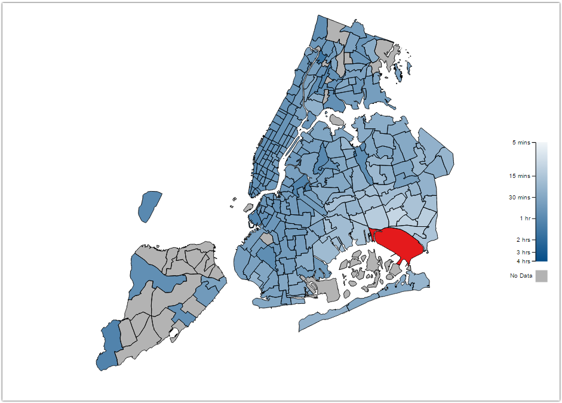
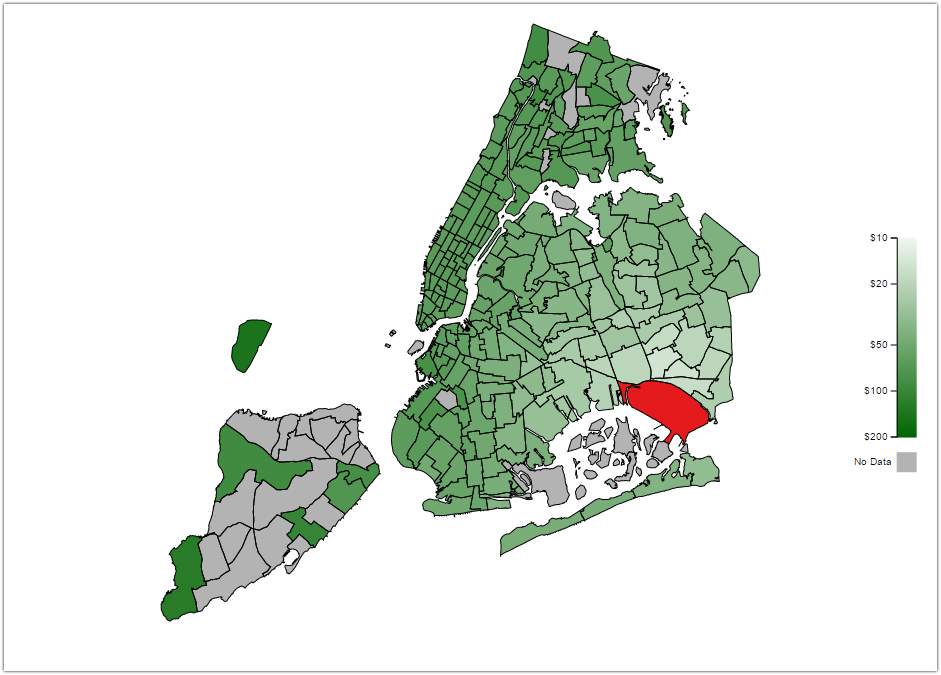
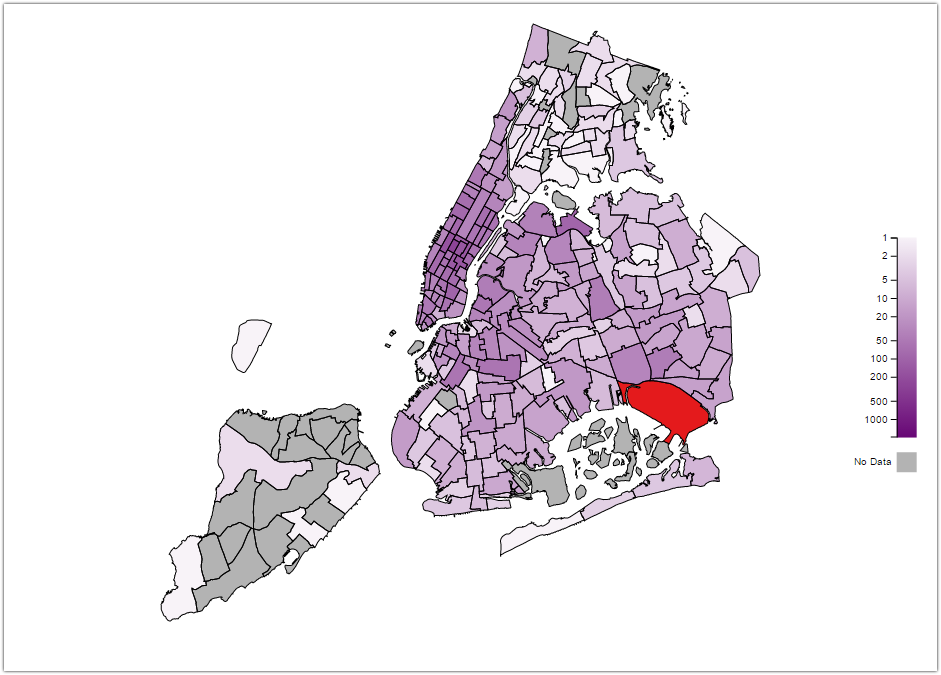

NYC Taxi Data Visualization
===================================

Team:
* [Daniel Beckwith](https://github.com/dbeckwith)
* [Aditya Nivarthi](https://github.com/SIZMW)

## Description
This visualization aims to show insights into taxi trip data across predefined taxi zones in New York City.

### Visualizations
#### Average Trip Time

This visualization shows taxi zones and the average time required to make a taxi trip from the selected zone to any other given zone, or vice versa. The goal is to show travel time between zones, and provide insight into how long certain fares will take a taxi driver to complete.

#### Average Trip Fare Cost

This visualization shows taxi zones and the average fare cost to the passenger(s) needed to make a trip from the selected zone to any other given zone, or vice versa. The goal is to show the monetary cost to travel between zones, and provide insight into how much could be earned by doing certain fares as a driver.

#### Trip Frequency

This visualization shows the number of trips to or from a selected zone to or from any other given zone. The goal is to show frequencies of trips being made between zones, specifically show popular trips (for example, airport to major landmark). For taxi drivers, it provides insight into taxi fares that have a higher chance of happening, and understanding which fares are more available to complete.

#### Time Of Year
All the previously mentioned visualizations can be filtered by month during the year, which provides insight into how travel habits in taxis change over the course of a year.

### Data Source
The raw data used in this visualization was gathered from the [here](http://www.nyc.gov/html/tlc/html/about/trip_record_data.shtml).

## Resources
* [SVG gradient scales](http://www.visualcinnamon.com/2016/05/smooth-color-legend-d3-svg-gradient.html)

## Usage
The visualization can be seen [here](https://sizmw.github.io/nyc-taxi-vis/).
